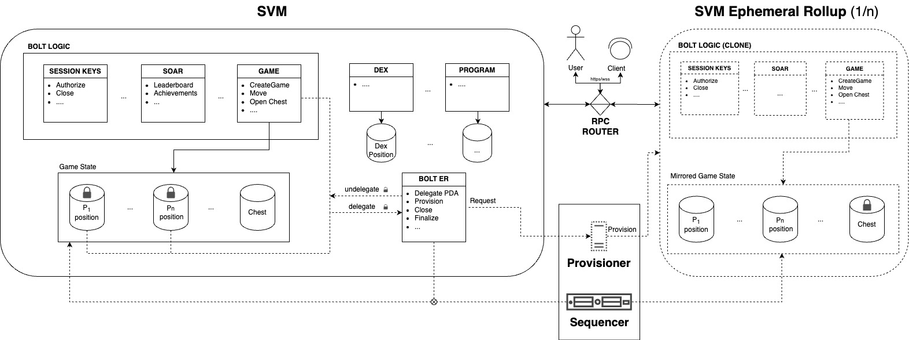

# Ephemeral Rollups

The core intuition is that by harnessing the SVM's account structure and its capacity for parallelization, we can split the app/game state into clusters. Users can lock one or multiple accounts to temporarily transfer the state to an auxiliary layer,  which we define as the "ephemeral rollup", a configurable dedicated runtime. 

This process temporarily entrusts the sequencer to modify the accounts in the ephemeral rollup, where the state can be forcefully reverted and unlocked on the L1 if constraints are not satisfied (read the [whitepaper](https://book.boltengine.gg/files/Ephemeral_Rollups_are_All_you_Need.pdf) for more details). Despite this delegation, operations and transactions can still use the delegate accounts as readable on the base layer. Non-delegated accounts remain unaffected and modifiable. 

The ephemeral rollup operates as a specialized SVM runtime to facilitate transaction processing at an elevated throughput. Additionally, this specialized runtime can be customized to include configurations like gasless transactions, quicker block-time, and the inclusion of a ticking mechanism (i.e., an integrated transaction scheduling system like [clockwork](https://github.com/clockwork-xyz/clockwork)) operated without fees). The entire process is transparent to the end user - a specialized RPC provider can route the transactions to the base layer and the ephemeral rollup(s) in parallel during the game session.

## White Paper

Bolt white paper describes in details the architecture and the scalability solution. We recommend reading the basic concepts of ephemeral rollups in section 2.2 of the [Bolt Whitepaper](https://book.boltengine.gg/files/Ephemeral_Rollups_are_All_you_Need.pdf)

## Avoiding Fragmentation and Benefits

The benefit of ER is that programs and assets reside directly on the base layer. Transactions can be accelerated through ERs, which are fully compatible with the Solana Virtual Machine (SVM) down to the bytecode level. Any improvements or advancements at the base layer are immediately available, without the need to modify or re-deploy programs. 

Ephemeral Rollups has the following benefits:

- Developers **deploy programs to the base layer** (e.g., Solana),  rather than on a separate chain as it would normally happen with rollups. Programs live on the base layer and can interact with any existing protocol and assets. ERs don't fragment the existing ecosystem and allow the speed-up of targeted operations without creating an isolated environment.

- Users, developers and programs using ERs can take advantage of **Solana's infrastructure**. This includes programming languages, code libraries, testing tools, client software, deployment infrastructure etc.
- The **specialized runtime** can accommodate game-specific customizations (e.g., ticking or passive events, typical in games, as opposed to the event-driven runtime of blockchains) without the need to pay gas for fees on those specific accounts. 
- This approach enables a **highly scalable system** capable of launching rollups on-demand, **auto-scaling** horizontally to accommodate users performing millions of transactions without the tradeoffs of traditional L2s.
